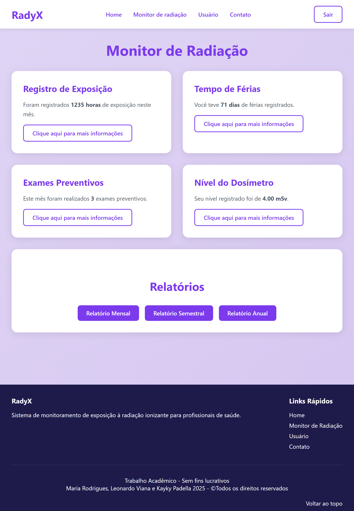
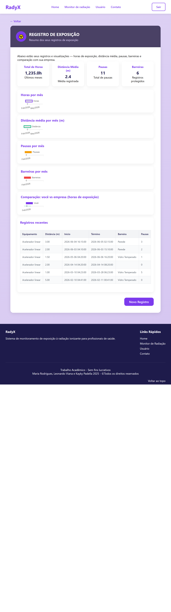
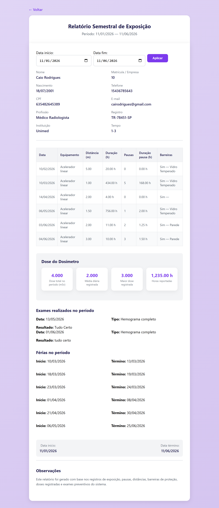
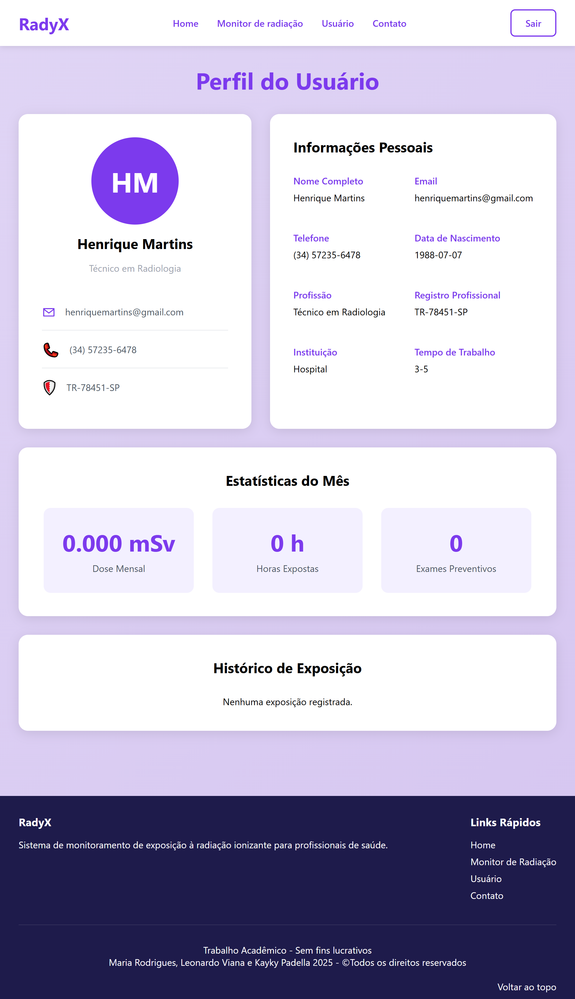
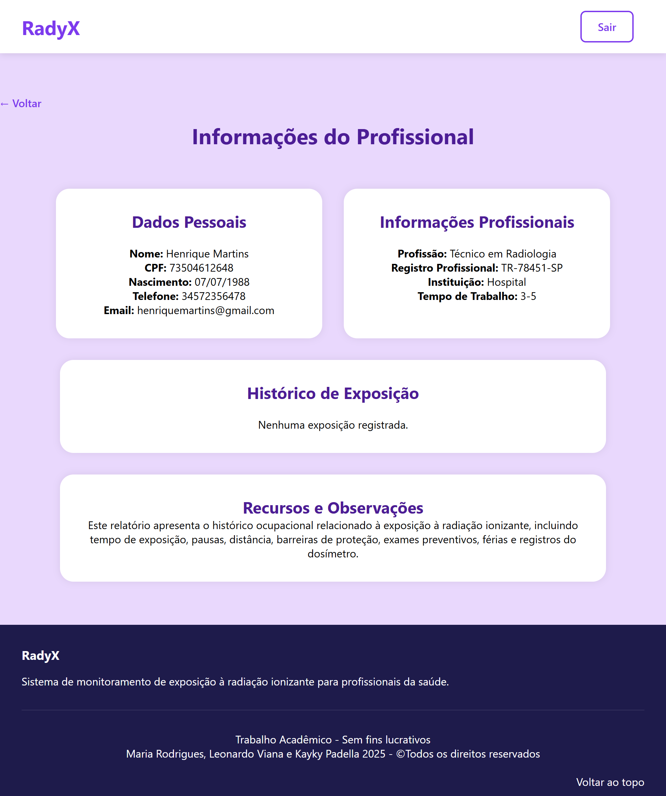

# Sistema de Monitoramento da Radiação Ionizante

## Descrição

Projeto desenvolvido como Trabalho de Conclusão de Curso (TCC) com o objetivo de auxiliar no acompanhamento da exposição à radiação ionizante de profissionais da saúde.

O sistema permite o gerenciamento de funcionários, monitoramento de dosimetria, controle de exames ocupacionais e registro de exposições, contribuindo para a segurança ocupacional e conformidade com normas de proteção radiológica.

## Tecnologias Utilizadas

- PHP
- MySQL
- HTML5
- CSS3
- JavaScript

## Funcionalidades

- Cadastro de profissionais
- Cadastro de instituições
- Registro de doses mensais
- Controle de exames ocupacionais
- Registro de exposições
- Relatórios

## Requisitos

- PHP
- MySQL ou MariaDB
- Servidor local (XAMPP, WAMP, Laragon ou similar)
- Navegador web

## Instalação

1. Clone ou baixe este repositório.
2. Copie a pasta do projeto para o diretório do servidor web.
   - Exemplo no XAMPP: `C:\xampp\htdocs`
3. Crie um banco de dados MySQL.
4. Importe o arquivo `database.sql`.
5. Configure as credenciais de conexão no arquivo `conn.php`.
6. Inicie os serviços Apache e MySQL.
7. Acesse o sistema pelo navegador utilizando o endereço configurado em seu ambiente local.

## Imagens do Sistema

### Área do Funcionário

#### Painel de Monitoramento

#### Registro de Exposição

#### Relatório Semestral

#### Página do Usuário

### Área da Instituição

#### Gerenciamento de Profissional

#### Informação dos Profissionais (screenshots/funcionario_infos.png)

## Observação

Os dados apresentados nas imagens e exemplos deste projeto são inteiramente fictícios, não correspondendo a pessoas ou instituições reais. Seu uso tem finalidade exclusivamente acadêmica e demonstrativa.

## Autores

- Maria Fernanda Marques Rodrigues
- Kayky Alves Padella
- Leonardo Miguel Silva Viana